# DevX Project

DevX is a responsive landing page website aimed at practicing the basics of web developement, it is ideal for showcasing tech talents in Africa.

## Description

This project demonstrates how how a proffesional looking landing page can be built using just HTML and CSS, without any Javascript of frameworks. It feautures clean layout sections such as navbar, hero, other body sections and footer. Built using the mobile first design approach.

## Built With

**HTML5**

**CSS3**

## Preview

##### Desktop View

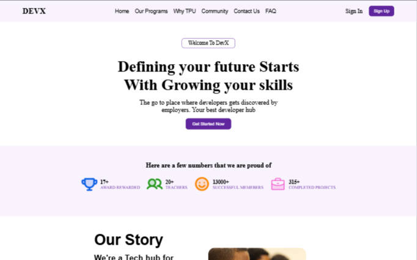

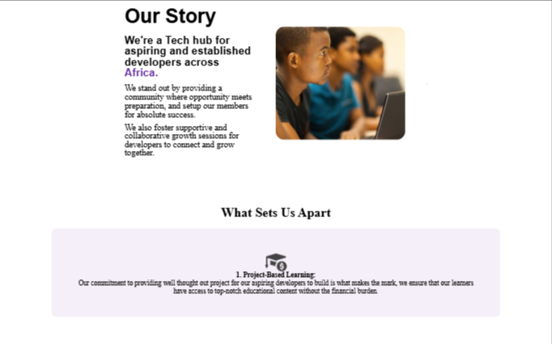

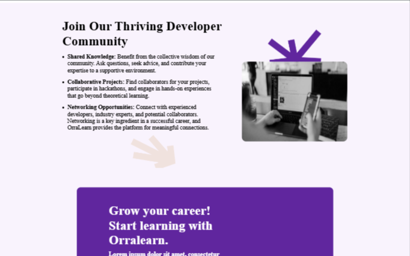


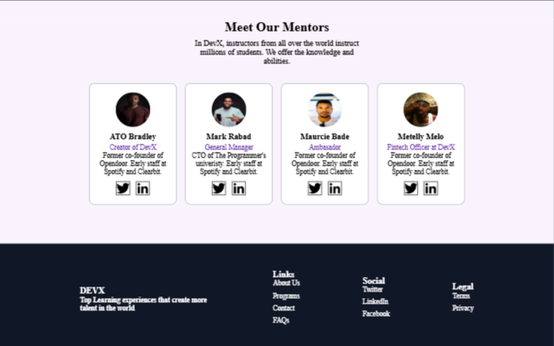

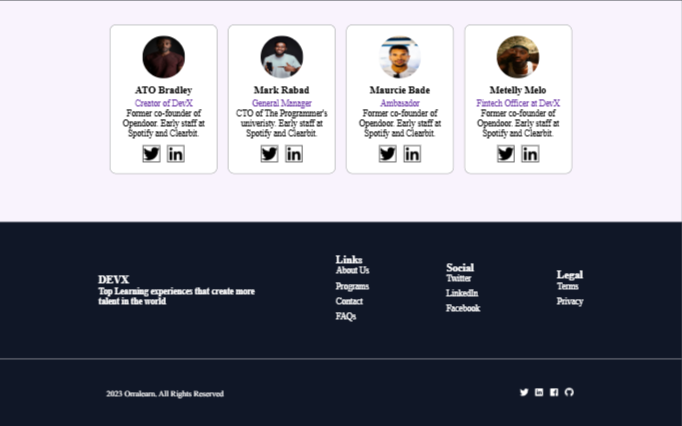

##### Tablet View

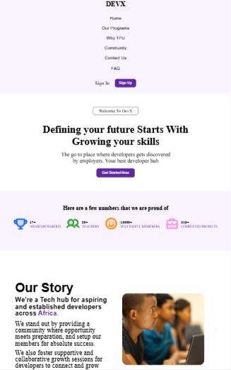

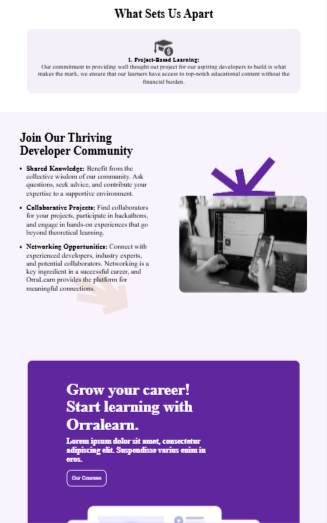

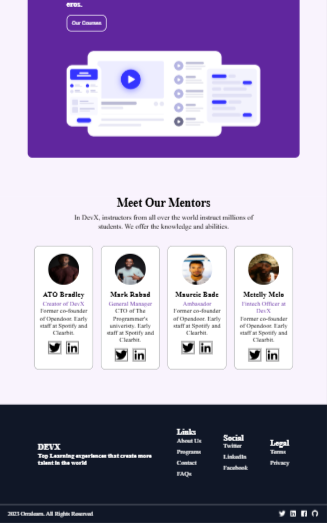

##### Mobile View

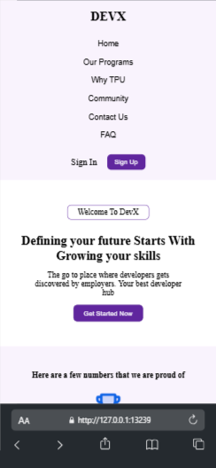

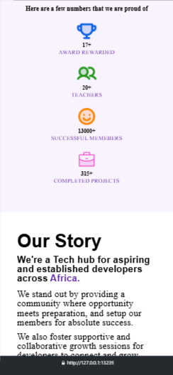

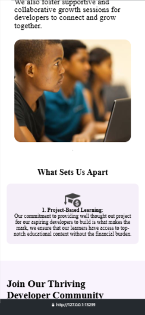


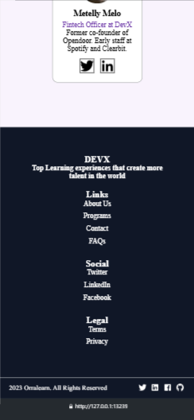

## Live Demo

[Click her to view the live site](https://devx-project.netlify.app "DevX Live Site")

## How to Use

1. Download or clone the repository:

```
	bash git clone https://github.com/besong-marlon/DEVX.git
```

2. Open index.html in any web browser. Thats it, no setup or dependencies rquired

## Features

- Responsive
- Mobile-first layout
- Easy to customize

## Author

Besong Marlon

Email: besongmarlon01@gmail.com

GitHub: https://github.com/besong-marlon
